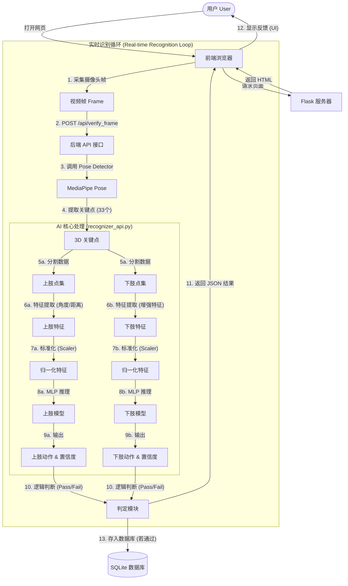

# KineSensei Web - 项目开发文档

## 1. 项目简介 (Project Overview)
本项目 **KineSensei Web** 是一个基于人工智能的街舞教学与动作评估平台。旨在解决传统街舞教学中反馈不及时、缺乏量化标准、地域资源不均等问题。系统通过 **Flask** 搭建 Web 服务，利用 **MediaPipe** 进行人体姿态估计，并结合 **PyTorch** 构建的 **MLP (多层感知机)** 神经网络模型，实现了低成本、高精度的实时动作识别与评分反馈。

## 2. 系统架构 (System Architecture)

系统采用 **B/S (Browser/Server)** 架构：

*   **前端 (Frontend)**:
    *   使用 HTML5/CSS/JavaScript 构建用户界面。
    *   调用摄像头 (Webcam) 实时采集视频流。
    *   通过 AJAX/Fetch API 将视频帧发送至后端进行分析。
    *   接收后端返回的识别结果（动作名称、置信度、是否通过）并实时展示。

*   **后端 (Backend)**:
    *   **Web 框架**: Python Flask。
    *   **数据库**: SQLite (通过 Flask-SQLAlchemy ORM 管理)，存储用户信息、课程数据、关卡数据及学习进度。
    *   **核心逻辑**: 处理用户请求，管理会话 (Session)，提供 API 接口。

*   **AI 引擎 (AI Engine)**:
    *   **姿态提取**: Google MediaPipe Pose，从图像中提取 33 个 3D 身体关键点。
    *   **特征工程**: 将原始坐标转换为对尺度和位置不敏感的特征（如肢体夹角、相对距离）。
    *   **动作分类**: 双流 MLP 模型 (Dual-Stream MLP)，分别对“上肢”和“下肢”动作进行分类。

## 3. 程序流程图 (Program Flowchart)

以下流程图展示了从用户开始学习到系统反馈的完整数据流向：

## 4. 详细代码说明 (Detailed Code Explanation)

### 4.1. Web 应用入口 (`app.py`)
这是整个 Web 应用的核心控制器。

*   **路由管理**:
    *   `/`, `/login`, `/register`: 用户认证模块。
    *   `/courses`, `/learn`: 课程展示与学习流程。
    *   `/admin/...`: 管理员后台，用于上传视频、管理用户和课程。
*   **API 接口**:
    *   `/api/verify_frame`: 核心接口。
        1.  接收前端上传的图片文件。
        2.  调用 `pose_detector` 获取骨架数据。
        3.  根据当前关卡要求 (`require_upper`, `require_lower`) 调用 `classify_confidence_from_keypoints`。
        4.  计算综合置信度，判断是否通关。
        5.  若通关，更新 `Progress` 数据库表。
*   **数据库模型 (`models.py` 引用)**:
    *   `User`: 用户账号与权限。
    *   `Course` / `Level`: 课程与关卡结构。
    *   `Progress`: 记录用户通关状态。

### 4.2. AI 识别核心 (`recognizer_api.py`)
封装了所有与 AI 相关的逻辑，对外提供简单的调用接口。

*   **模型加载**:
    *   在模块初始化时加载 `mlp_upper_model.pth` 和 `mlp_lower_model.pth` 以及对应的 `scaler` (标准化器)。
    *   初始化 MediaPipe Pose 实例。
*   **特征提取函数**:
    *   `extract_upper_features(pts)`: 计算上肢 12 个点的距离和夹角。
    *   `lower_enhanced_features(pts)`: 针对下肢设计的增强特征，包括大腿/小腿长度、膝盖夹角、髋关节倾斜角、重心偏移量 (Hip-Foot bias) 等，有效提升了复杂舞步的识别率。
*   **推理函数**:
    *   `classify_confidence_from_keypoints`: 接收关键点和目标动作标签，执行模型前向传播 (Forward Pass)，通过 `Softmax` 获取目标类别的概率值 (Confidence)。

### 4.3. 模型训练模块 (`mlp/`)
包含模型的训练脚本和网络定义。

*   **网络结构 (`PoseClassifier`)**:
    *   简单的全连接神经网络 (MLP)。
    *   结构: Input -> Linear -> BN -> ReLU -> Dropout -> Linear -> BN -> ReLU -> Dropout -> Output。
    *   使用 Dropout (0.4) 防止过拟合。
*   **训练流程 (`train_upper.py` / `train_lower.py`)**:
    1.  **加载数据**: 读取 `.npy` 格式的特征数据和标签。
    2.  **数据增强**: 在训练时实时添加高斯噪声、随机缩放、左右镜像翻转，增强模型鲁棒性。
    3.  **标准化**: 使用 `StandardScaler` 对特征进行归一化 (Z-Score)，这对神经网络收敛至关重要。
    4.  **训练循环**: 使用 Adam 优化器和 CrossEntropyLoss 损失函数。
    5.  **早停机制 (Early Stopping)**: 监控验证集准确率，若连续 10 个 Epoch 不提升则停止训练并保存最佳模型。

## 5. 核心技术亮点

1.  **双流识别架构 (Dual-Stream Architecture)**:
    *   将人体分为“上肢”和“下肢”两个独立的识别流。这允许系统灵活组合动作（例如：上半身做 "Wave"，下半身做 "Bounce"），解决了传统整体识别模型难以处理组合动作的问题。

2.  **轻量化与实时性**:
    *   MediaPipe 在 CPU 上即可流畅运行。
    *   MLP 网络结构简单，推理耗时极低 (<5ms)。
    *   整体方案可在普通笔记本或手机浏览器上实时运行，无需昂贵的 GPU 服务器。

3.  **鲁棒的特征工程**:
    *   不直接使用原始坐标 (x, y)，而是计算**相对特征** (角度、距离比率)。这使得模型对用户在摄像头中的位置、距离远近、身材高矮不敏感，极大地提高了泛化能力。

4.  **数据驱动的反馈**:
    *   系统不仅判断“对/错”，还通过 Softmax 输出“置信度”。这可以转化为分数值，让用户直观了解动作的规范程度。
